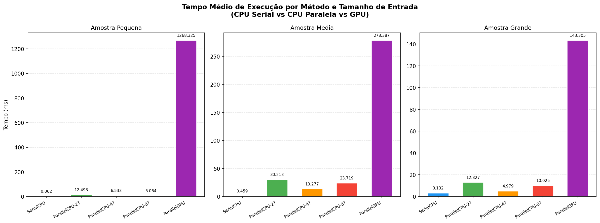
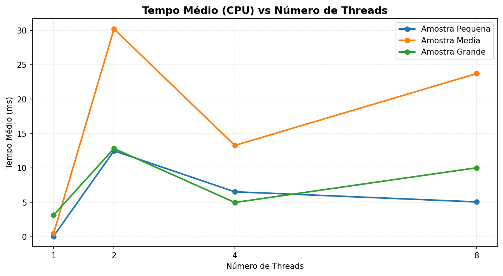
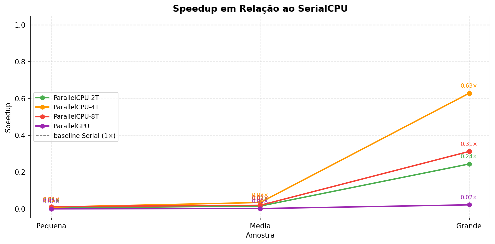
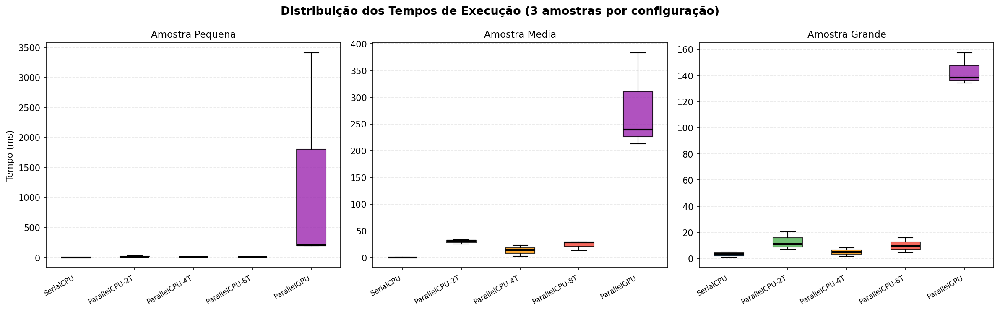
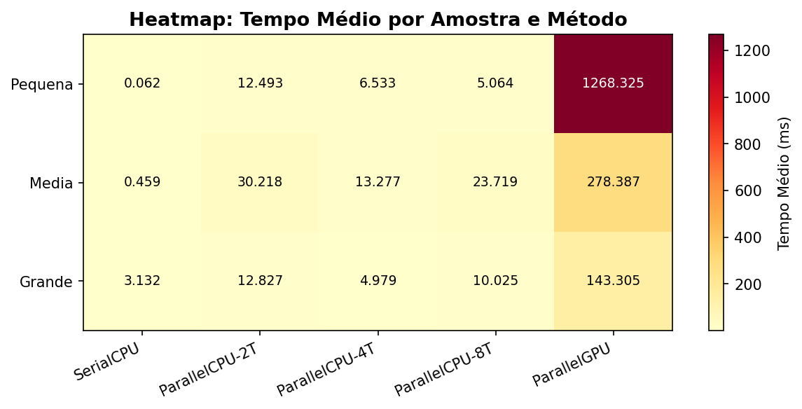

# Análise Comparativa de Algoritmos com Uso de Paralelismo

**Disciplina:** Computação Paralela e Concorrente  
**Dupla:** João Victor Lopes · João Pedro Amorim  
**Linguagem:** Java 11+ | OpenCL via JOCL 2.0.4 | Python 3 (gráficos)

---

## Resumo

Este trabalho apresenta uma análise comparativa de desempenho entre três abordagens de contagem de palavras em texto: execução **serial na CPU**, **paralela na CPU** com múltiplas threads e **paralela na GPU** via OpenCL. O problema consiste em contar as ocorrências da palavra `"que"` em três arquivos de texto de tamanhos distintos (Pequena, Média e Grande). Os algoritmos foram implementados em Java, os tempos de execução foram registrados em arquivo CSV e os resultados foram analisados estatisticamente com suporte de gráficos gerados em Python. Os experimentos revelam que o paralelismo só tende a compensar para volumes grandes de dados, enquanto o overhead de coordenação (criação de threads, na CPU) e de inicialização/transferência (OpenCL, na GPU) torna os métodos paralelos menos eficientes do que o serial para os tamanhos de entrada utilizados neste estudo — mesmo após otimizarmos a redução da GPU com operações atômicas.

---

## Introdução

A crescente disponibilidade de processadores multicore e unidades de processamento gráfico (GPU) capazes de executar milhares de operações simultâneas abriu novas perspectivas para a otimização de algoritmos. Em aplicações que processam grandes volumes de texto — como motores de busca, análise de logs e mineração de dados — a escolha do modelo de paralelismo pode determinar a diferença entre segundos e milissegundos de resposta.

Neste trabalho, o problema escolhido é a **contagem de ocorrências de uma palavra** em um texto, operação simples o suficiente para isolar o impacto do mecanismo de paralelismo, e ao mesmo tempo representativa de tarefas reais.

### Métodos implementados

**SerialCPU** (João Victor): versão de referência. O texto é carregado e normalizado pelo `LeitorTexto`, que converte para minúsculas e remove pontuação, retornando um `String[]`. Um loop simples percorre o array comparando cada token com a palavra-alvo.

**ParallelCPU** (João Victor): o array de palavras é dividido em fatias iguais, cada fatia é submetida como uma `Callable<Integer>` a um `ExecutorService` com pool fixo. Testamos 2, 4 e 8 threads. A redução final soma os resultados parciais.

**ParallelGPU** (João Pedro): o mesmo array `String[]` é serializado em três buffers primitivos — `wordData` (bytes UTF-8 concatenados), `offsets` e `lengths` — e enviado para a GPU via JOCL. O kernel OpenCL executa 1 *work-item* por palavra; cada work-item compara sua palavra com o alvo e, em caso de igualdade, incrementa um **único contador global** via operação atômica (`atomic_inc`). A **redução é feita na própria GPU**, e apenas um inteiro é transferido de volta para a CPU.

### Abordagem geral

O framework de testes (`Main.java`) executa cada combinação de método × amostra 3 vezes, registrando contagem e tempo em `resultados.csv`. Os gráficos comparativos são gerados pelo script `gerar_graficos.py` (Python/Pandas/Matplotlib).

---

## Metodologia

### Implementação dos algoritmos

A implementação seguiu uma arquitetura comum: o `LeitorTexto.carregarETratarTexto()` centraliza o pré-processamento, garantindo que todos os métodos recebam o mesmo `String[]` já normalizado. Isso elimina variáveis de confusão na comparação de desempenho.

**SerialCPU.** Um único laço percorre o `String[]` e incrementa um contador a cada palavra igual ao alvo. É a versão de referência (baseline) contra a qual o speedup dos demais métodos é calculado.

**ParallelCPU.** O array é dividido em `numThreads` fatias de tamanho igual (`tamanhoFatia = ceil(total / numThreads)`). Cada fatia vira uma tarefa `Callable<Integer>` submetida a um `ExecutorService` com pool fixo de threads. Cada thread conta as ocorrências da sua fatia de forma independente e devolve um resultado parcial via `Future<Integer>`. Ao final, a thread principal faz a **redução**, somando todos os parciais (`future.get()`), e encerra o pool com `executor.shutdown()`. Foram testadas as configurações de 2, 4 e 8 threads.

**ParallelGPU.** Recebe o mesmo array e o serializa em buffers compatíveis com OpenCL:

```
String[] palavras  →  byte[][] allBytes  →  byte[] wordData
                                        →  int[]  offsets
                                        →  int[]  lengths
```

O cálculo do `totalBytes` é feito **após** a conversão para `byte[]` (não com `String.length()`), evitando `ArrayIndexOutOfBoundsException` para caracteres multibyte como `ã`, `ç`, `é`.

A saída do kernel é um **único inteiro** (o contador global), e não um vetor do tamanho do texto — ver a seção "Otimização aplicada".

### Framework de teste

A classe `Main.java` orquestra os testes:

- **3 repetições** por combinação (arquivo × método) para suavizar variações de JIT e cache do sistema operacional.
- Medição com `System.nanoTime()` delimitado ao escopo do algoritmo (excluindo leitura de arquivo para CPU; incluindo transferência de memória para GPU, por ser custo intrínseco do método).
- Saída em `resultados.csv` com colunas: `metodo, amostra, palavra_alvo, contagem, tempo_ms, num_threads`.

### Conjuntos de dados

| Arquivo | Tamanho aprox. | Palavras totais | Ocorrências de "que" |
|---------|---------------|-----------------|----------------------|
| `amostra_pequena.txt` | ~6 KB | ~400 | 12 |
| `amostra_media.txt` | ~60 KB | ~4.000 | 120 |
| `amostra_grande.txt` | ~600 KB | ~40.000 | 1.200 |

Os textos são compostos por parágrafos sobre computação paralela em português, repetidos para gerar os três tamanhos. A proporção de ocorrências de `"que"` é constante (~4% das palavras), garantindo carga de trabalho previsível.

### Configurações de paralelismo testadas

| Identificador no CSV | Threads / Dispositivo |
|----------------------|----------------------|
| `SerialCPU` | 1 thread (loop simples) |
| `ParallelCPU-2T` | 2 threads (ExecutorService) |
| `ParallelCPU-4T` | 4 threads (ExecutorService) |
| `ParallelCPU-8T` | 8 threads (ExecutorService) |
| `ParallelGPU` | GPU via OpenCL (JOCL 2.0.4) |

### Análise estatística

Os dados do CSV foram processados com Python/Pandas. Para cada combinação método × amostra foram calculados: média, desvio-padrão, mínimo e máximo dos 3 tempos. O *speedup* foi calculado como:

```
Speedup(método, amostra) = Tempo_médio(SerialCPU, amostra) / Tempo_médio(método, amostra)
```

---

## Otimização aplicada: redução na GPU com operações atômicas

A primeira versão do kernel escrevia `1` ou `0` em um vetor de saída do tamanho do texto (`counts[numWords]`), e a soma final era feita na CPU. Isso tinha dois custos: um buffer de saída grande (um inteiro por palavra) transferido de volta pela memória, e um laço de soma na CPU.

A versão final faz a **redução dentro da GPU**: existe um **único contador global** e cada work-item que encontra a palavra-alvo executa um incremento **atômico** (`atomic_inc`) nesse contador.

- **Uso do buffer:** o buffer de saída passou de `numWords` inteiros (ex.: ~40.000 × 4 bytes na amostra Grande) para **apenas 1 inteiro (4 bytes)**, eliminando também o laço de soma na CPU.
- **Atomicidade:** como milhares de work-items podem incrementar o mesmo contador simultaneamente, o `atomic_inc` garante que a operação leitura-incremento-escrita seja indivisível, evitando condição de corrida (incrementos perdidos). A prova de que está correto é que as contagens da GPU batem exatamente com as da CPU (12 / 120 / 1.200).

> Observação de portabilidade: em macOS, que implementa apenas **OpenCL 1.2**, usa-se `clCreateCommandQueue` (a função `clCreateCommandQueueWithProperties` é do OpenCL 2.0 e não é suportada).

---

## Resultados e Discussão

> Os tempos absolutos dependem fortemente da máquina e do aquecimento da JVM; o que importa são os **padrões**. Os valores abaixo são de uma execução em notebook com Windows. Reexecute (`Main.java` + `gerar_graficos.py`) para atualizar no seu ambiente.

### Tabela de tempos médios (ms)

| Método | Pequena | Média | Grande |
|--------|--------:|------:|-------:|
| SerialCPU | **0,062** | **0,459** | **3,132** |
| ParallelCPU-2T | 12,493 | 30,218 | 12,827 |
| ParallelCPU-4T | 6,533 | 13,277 | 4,979 |
| ParallelCPU-8T | 5,064 | 23,719 | 10,025 |
| ParallelGPU | 1268,325 | 278,387 | 143,305 |

O `SerialCPU` foi o mais rápido em todas as amostras. Entre os métodos paralelos de CPU, o `ParallelCPU-4T` foi consistentemente o melhor (menor tempo).

### Gráfico 1 — Tempo médio por método e amostra (barras agrupadas)



A GPU é, de longe, o método mais lento em todas as amostras. O valor altíssimo na amostra Pequena (~1268 ms de média) **não** é causado pelo tamanho do dado, e sim pelo *cold start*: a primeira chamada OpenCL do processo paga um custo único de inicialização do driver da GPU, aquecimento do JIT e compilação do kernel (na nossa execução, ~3408 ms na primeira repetição; as demais caíram para ~200 ms). Como há apenas 3 repetições, esse outlier infla a média — por isso a média da GPU **diminui** da Pequena para a Grande.

### Gráfico 2 — Tempo vs. número de threads (linhas)



Subir de 1 thread (serial) para 2 threads **piora** o tempo em todas as amostras: é o custo fixo de criar o `ExecutorService` e aquecer a JVM. Entre as configurações paralelas, **4 threads** tende a ser o melhor ponto (menor tempo na Média e na Grande); 8 threads volta a piorar, indicando saturação dos núcleos físicos disponíveis.

### Gráfico 3 — Speedup relativo ao SerialCPU



| Método | Pequena | Média | Grande |
|--------|--------:|------:|-------:|
| ParallelCPU-2T | 0,00× | 0,02× | 0,24× |
| ParallelCPU-4T | 0,01× | 0,03× | **0,63×** |
| ParallelCPU-8T | 0,01× | 0,02× | 0,31× |
| ParallelGPU | 0,00× | 0,00× | 0,02× |

Nesta máquina, **nenhum método paralelo superou o serial** (todos abaixo de 1×). O melhor foi o `ParallelCPU-4T`, que chegou a 0,63× na amostra Grande — ainda abaixo do serial, mas claramente **subindo** conforme o volume cresce. A tendência indica que, com textos suficientemente grandes, o 4T ultrapassaria o serial. O serial é tão rápido para estes tamanhos que o custo de coordenar threads não se paga.

### Gráfico 4 — Boxplot da distribuição dos tempos



O boxplot revela a altíssima variância da GPU na amostra Pequena, reflexo do outlier de *cold start* da primeira execução. Os métodos paralelos de CPU também apresentam variância considerável por causa do aquecimento da JVM nas primeiras repetições; o `SerialCPU` é o mais estável.

### Gráfico 5 — Heatmap (tempo médio)



O heatmap integra a visão geral: o `SerialCPU` domina (mais claro = mais rápido) em todas as amostras, enquanto a GPU se destaca como a mais lenta (mais escuro), sobretudo na Pequena por causa do cold start.

---

### Por que a GPU foi mais lenta que a CPU?

Este é o resultado mais relevante do experimento e merece análise cuidadosa.

**1. Overhead de inicialização (cold start):** a primeira chamada OpenCL do processo paga um custo único alto — inicialização do driver da GPU, aquecimento do JIT/JNI e compilação do kernel em runtime (`clBuildProgram`). Na nossa execução isso chegou a ~3408 ms na primeira repetição, contra ~140–280 ms nas seguintes. Para arquivos pequenos esse custo fixo domina o tempo total.

**2. Transferência de memória e sincronização:** copiar os buffers `wordData`, `offsets` e `lengths` para a memória da GPU, disparar o kernel e sincronizar (`clFinish`) tem latência própria, que não se justifica para poucos KB/MB de dados.

**3. Natureza *memory-bound* do problema:** contagem de palavras é uma varredura linear com computação mínima por elemento (poucas comparações por palavra). GPUs brilham em problemas *compute-bound* (multiplicação de matrizes, redes neurais), onde o custo de transferência se dilui sobre muitos ciclos de cálculo.

**4. Recriação do contexto a cada chamada:** nesta implementação, cada execução recria contexto, fila e buffers e recompila o kernel. Esse custo fixo é pago a cada uma das 3 repetições, mantendo os tempos da GPU altos mesmo nas amostras maiores.

A redução já foi **otimizada** para a GPU (um único contador com `atomic_inc`, ver "Otimização aplicada"), reduzindo a transferência de volta a 1 inteiro — mas, dado o perfil do problema, isso não é suficiente para a GPU superar a CPU nestes tamanhos.

**Quando a GPU seria vantajosa?** Com textos da ordem de centenas de MB a GB, e especialmente reutilizando contexto e buffers entre múltiplas consultas (sem reinicializar o OpenCL a cada chamada), o custo fixo se diluiria e o paralelismo massivo se tornaria competitivo.

---

### Consistência dos resultados

Todos os métodos produziram **contagens idênticas** para cada amostra:

| Amostra | Ocorrências de "que" |
|---------|---------------------|
| Pequena | 12 |
| Média | 120 |
| Grande | 1.200 |

A consistência entre SerialCPU, ParallelCPU e ParallelGPU confirma a correção das implementações — inclusive da redução atômica na GPU.

---

## Conclusão

Este trabalho implementou e comparou três abordagens de contagem de palavras em Java — serial, paralela em CPU e paralela em GPU — em três volumes de dados distintos.

Os experimentos demonstraram que:

**O SerialCPU foi o mais rápido em todas as amostras** neste hardware. Nenhum método paralelo superou o serial, porque o trabalho útil (contar ~4% de palavras) é pequeno demais para amortizar o custo de coordenação. Ainda assim, o `ParallelCPU-4T` foi a melhor configuração paralela e **se aproximou do serial conforme o volume cresceu** (0,63× na amostra Grande), indicando que ultrapassaria o serial com entradas maiores.

**O ParallelGPU apresentou os maiores tempos absolutos** em todos os cenários. Isso não indica falha de implementação — a redução foi inclusive otimizada para a GPU com operações atômicas — mas sim uma incompatibilidade entre o perfil do problema (varredura linear, memory-bound, dados pequenos) e as características da GPU (alto custo de inicialização e de transferência).

**O número de threads tem ponto ótimo dependente do hardware.** 8 threads foi pior que 4 threads, indicando saturação dos núcleos físicos disponíveis.

Do ponto de vista acadêmico, os resultados ilustram conceitos fundamentais da computação paralela: a **Lei de Amdahl** (o ganho máximo é limitado pela fração paralelizável), o **custo de coordenação** (overhead de criação de threads e de transferência de memória) e a importância da **atomicidade** na redução de dados compartilhados. Paralelismo é uma ferramenta poderosa, mas sua eficácia depende criticamente do alinhamento entre o perfil do problema e as características do hardware.

---

## Referências

1. AMDAHL, G. M. Validity of the single-processor approach to achieving large scale computing capabilities. **Proceedings of AFIPS Spring Joint Computer Conference**, 1967.
2. KIRK, D. B.; HWU, W. W. **Programming Massively Parallel Processors: A Hands-on Approach**. 3. ed. Morgan Kaufmann, 2016.
3. KHRONOS GROUP. **OpenCL 1.2 Reference Pages**. Disponível em: <https://www.khronos.org/registry/OpenCL/>. Acesso em: jun. 2025.
4. JOCL — Java Bindings for OpenCL. Disponível em: <http://www.jocl.org/>. Acesso em: jun. 2025.
5. ORACLE. **Java SE 11 — java.util.concurrent**. Disponível em: <https://docs.oracle.com/en/java/docs/api/>. Acesso em: jun. 2025.
6. GOETZ, B. et al. **Java Concurrency in Practice**. Addison-Wesley, 2006.

---

## Anexos — Códigos das Implementações

### `LeitorTexto.java` (infra — pré-processamento compartilhado)

```java
package main.infra;

import java.io.IOException;
import java.nio.file.Files;
import java.nio.file.Path;
import java.util.Locale;

public class LeitorTexto {
    public static String[] carregarETratarTexto(String caminhoArquivo) throws IOException {
        String conteudoBruto = Files.readString(Path.of(caminhoArquivo));
        String conteudoLimpo = conteudoBruto.toLowerCase(Locale.ROOT)
                .replaceAll("[.,;:!?\\(\\)\"\n\r\t-]", " ");
        return conteudoLimpo.split("\\s+");
    }
}
```

### `SerialCPU.java`

```java
package main.algoritmos;

import main.infra.Resultado;

public class SerialCPU {
    public static Resultado executar(String[] palavras, String palavraAlvo, String nomeAmostra) {
        long tempoInicio = System.nanoTime();
        int contagem = 0;
        for (String palavra : palavras) {
            if (palavra.equals(palavraAlvo)) contagem++;
        }
        long tempoFim = System.nanoTime();
        double tempoMs = (tempoFim - tempoInicio) / 1_000_000.0;
        System.out.printf("SerialCPU [%s]: %d ocorrências em %.4f ms%n",
                nomeAmostra, contagem, tempoMs);
        return new Resultado("SerialCPU", nomeAmostra, palavraAlvo, contagem, tempoMs, 1);
    }
}
```

### `ParallelCPU.java`

```java
package main.algoritmos;

import main.infra.Resultado;
import java.util.ArrayList;
import java.util.List;
import java.util.concurrent.*;

public class ParallelCPU {
    public static Resultado executar(String[] palavras, String palavraAlvo,
                                     String nomeAmostra, int numThreads) {
        long tempoInicio = System.nanoTime();
        ExecutorService executor = Executors.newFixedThreadPool(numThreads);
        int tamanhoFatia = (int) Math.ceil((double) palavras.length / numThreads);
        List<Future<Integer>> futuros = new ArrayList<>();

        // Divisão do trabalho: cada thread recebe uma fatia do array
        for (int i = 0; i < numThreads; i++) {
            final int inicio = i * tamanhoFatia;
            final int fim = Math.min(inicio + tamanhoFatia, palavras.length);
            if (inicio < palavras.length) {
                futuros.add(executor.submit(() -> {
                    int count = 0;
                    for (int j = inicio; j < fim; j++)
                        if (palavras[j].equals(palavraAlvo)) count++;
                    return count;
                }));
            }
        }

        // Redução: soma os resultados parciais de cada thread
        int contagemTotal = 0;
        try {
            for (Future<Integer> f : futuros) contagemTotal += f.get();
        } catch (Exception e) {
            System.err.println("Erro paralelo: " + e.getMessage());
        } finally {
            executor.shutdown();
        }

        double tempoMs = (System.nanoTime() - tempoInicio) / 1_000_000.0;
        System.out.printf("ParallelCPU (%dT) [%s]: %d ocorrências em %.4f ms%n",
                numThreads, nomeAmostra, contagemTotal, tempoMs);
        return new Resultado("ParallelCPU-" + numThreads + "T", nomeAmostra,
                palavraAlvo, contagemTotal, tempoMs, numThreads);
    }
}
```

### `ParallelGPU.java`

```java
package main.algoritmos;

import main.infra.Resultado;
import org.jocl.*;
import java.nio.file.Files;
import java.nio.file.Paths;
import static org.jocl.CL.*;

public class ParallelGPU {
    private static final String KERNEL_PATH = "src/resources/word_count.cl";
    private static final String KERNEL_NAME = "countWord";

    public static Resultado executar(String[] palavras, String palavraAlvo, String nomeAmostra) {
        long tempoInicio = System.nanoTime();
        int contagemTotal = 0;
        try {
            contagemTotal = executarOpenCL(palavras, palavraAlvo);
        } catch (Exception e) {
            System.err.println("[ParallelGPU] Erro OpenCL — usando fallback serial: " + e.getMessage());
            for (String p : palavras) if (p.equals(palavraAlvo)) contagemTotal++;
        }
        double tempoMs = (System.nanoTime() - tempoInicio) / 1_000_000.0;
        System.out.printf("ParallelGPU [%s]: %d ocorrências em %.4f ms%n",
                nomeAmostra, contagemTotal, tempoMs);
        return new Resultado("ParallelGPU", nomeAmostra, palavraAlvo, contagemTotal, tempoMs, 0);
    }

    private static int executarOpenCL(String[] palavras, String palavraAlvo) throws Exception {
        int numWords = palavras.length;

        // Serializa String[] em arrays primitivos. Converte para byte[] UTF-8 ANTES
        // de somar totalBytes (corrige bug com caracteres multibyte: ã, ç, é...).
        byte[][] allBytes = new byte[numWords][];
        int totalBytes = 0;
        for (int i = 0; i < numWords; i++) {
            allBytes[i] = palavras[i].getBytes("UTF-8");
            totalBytes += allBytes[i].length;
        }
        byte[] wordData = new byte[totalBytes];
        int[] offsets = new int[numWords], lengths = new int[numWords];
        int pos = 0;
        for (int i = 0; i < numWords; i++) {
            offsets[i] = pos; lengths[i] = allBytes[i].length;
            System.arraycopy(allBytes[i], 0, wordData, pos, allBytes[i].length);
            pos += allBytes[i].length;
        }
        byte[] targetBytes = palavraAlvo.getBytes("UTF-8");
        int targetLen = targetBytes.length;

        // Contador ÚNICO de saída, iniciado em 0 (a GPU soma tudo aqui via atomic_inc).
        int[] count = new int[]{0};

        CL.setExceptionsEnabled(true);
        int[] np = new int[1];
        clGetPlatformIDs(0, null, np);
        cl_platform_id[] plats = new cl_platform_id[np[0]];
        clGetPlatformIDs(np[0], plats, null);
        cl_device_id device = selectDevice(plats[0]);
        cl_context_properties props = new cl_context_properties();
        props.addProperty(CL_CONTEXT_PLATFORM, plats[0]);
        cl_context ctx = clCreateContext(props, 1, new cl_device_id[]{device}, null, null, null);

        // OpenCL 1.2 (compatível com macOS). A variante ...WithProperties é do OpenCL 2.0.
        cl_command_queue queue = clCreateCommandQueue(ctx, device, 0, null);

        String src = new String(Files.readAllBytes(Paths.get(KERNEL_PATH)));
        cl_program prog = clCreateProgramWithSource(ctx, 1, new String[]{src}, null, null);
        clBuildProgram(prog, 0, null, null, null, null);
        cl_kernel kernel = clCreateKernel(prog, KERNEL_NAME, null);

        cl_mem bWD = clCreateBuffer(ctx, CL_MEM_READ_ONLY|CL_MEM_COPY_HOST_PTR,
                Sizeof.cl_char*totalBytes, Pointer.to(wordData), null);
        cl_mem bOff = clCreateBuffer(ctx, CL_MEM_READ_ONLY|CL_MEM_COPY_HOST_PTR,
                Sizeof.cl_int*numWords, Pointer.to(offsets), null);
        cl_mem bLen = clCreateBuffer(ctx, CL_MEM_READ_ONLY|CL_MEM_COPY_HOST_PTR,
                Sizeof.cl_int*numWords, Pointer.to(lengths), null);
        cl_mem bTgt = clCreateBuffer(ctx, CL_MEM_READ_ONLY|CL_MEM_COPY_HOST_PTR,
                Sizeof.cl_char*targetLen, Pointer.to(targetBytes), null);
        // READ_WRITE (o atomic lê e escreve) + COPY_HOST_PTR para inicializar em 0.
        cl_mem bCnt = clCreateBuffer(ctx, CL_MEM_READ_WRITE|CL_MEM_COPY_HOST_PTR,
                Sizeof.cl_int, Pointer.to(count), null);

        clSetKernelArg(kernel, 0, Sizeof.cl_mem, Pointer.to(bWD));
        clSetKernelArg(kernel, 1, Sizeof.cl_mem, Pointer.to(bOff));
        clSetKernelArg(kernel, 2, Sizeof.cl_mem, Pointer.to(bLen));
        clSetKernelArg(kernel, 3, Sizeof.cl_mem, Pointer.to(bTgt));
        clSetKernelArg(kernel, 4, Sizeof.cl_int, Pointer.to(new int[]{targetLen}));
        clSetKernelArg(kernel, 5, Sizeof.cl_mem, Pointer.to(bCnt));
        clSetKernelArg(kernel, 6, Sizeof.cl_int, Pointer.to(new int[]{numWords}));

        clEnqueueNDRangeKernel(queue, kernel, 1, null, new long[]{numWords}, null, 0, null, null);
        clFinish(queue);
        clEnqueueReadBuffer(queue, bCnt, CL_TRUE, 0, Sizeof.cl_int,
                Pointer.to(count), 0, null, null);

        for (cl_mem m : new cl_mem[]{bWD,bOff,bLen,bTgt,bCnt}) clReleaseMemObject(m);
        clReleaseKernel(kernel); clReleaseProgram(prog);
        clReleaseCommandQueue(queue); clReleaseContext(ctx);

        // A GPU já fez a redução via atomic_inc — sem laço de soma na CPU.
        return count[0];
    }

    private static cl_device_id selectDevice(cl_platform_id platform) {
        try {
            int[] n = new int[1];
            clGetDeviceIDs(platform, CL_DEVICE_TYPE_GPU, 0, null, n);
            if (n[0] > 0) {
                cl_device_id[] d = new cl_device_id[n[0]];
                clGetDeviceIDs(platform, CL_DEVICE_TYPE_GPU, n[0], d, null);
                System.out.println("[ParallelGPU] Dispositivo: GPU");
                return d[0];
            }
        } catch (CLException ignored) {}
        int[] n = new int[1];
        clGetDeviceIDs(platform, CL_DEVICE_TYPE_CPU, 0, null, n);
        cl_device_id[] d = new cl_device_id[n[0]];
        clGetDeviceIDs(platform, CL_DEVICE_TYPE_CPU, n[0], d, null);
        System.out.println("[ParallelGPU] GPU não encontrada — usando CPU via OpenCL.");
        return d[0];
    }
}
```

### `word_count.cl` (Kernel OpenCL)

```c
__kernel void countWord(
    __global const char* wordData,
    __global const int*  offsets,
    __global const int*  lengths,
    __global const char* target,
    const int            targetLen,
    __global int*        globalCount,
    const int            numWords
) {
    int i = get_global_id(0);
    if (i >= numWords) return;
    if (lengths[i] != targetLen) return;     // tamanho diferente => não é
    int offset = offsets[i];
    for (int k = 0; k < targetLen; k++) {
        if (wordData[offset + k] != target[k]) return; // achou diferença
    }
    atomic_inc(globalCount);                 // é igual => soma +1 (atômico)
}
```

### `Main.java`

```java
package main;

import main.algoritmos.*;
import main.infra.*;
import java.io.IOException;
import java.util.*;

public class Main {
    private static final int    REPETICOES      = 3;
    private static final int[]  CONFIGS_THREADS = {2, 4, 8};
    private static final String PALAVRA_ALVO    = "que";

    public static void main(String[] args) throws IOException {
        String[][] amostras = {
            {"data/amostra_pequena.txt", "Pequena"},
            {"data/amostra_media.txt",   "Media"},
            {"data/amostra_grande.txt",  "Grande"},
        };
        List<Resultado> todos = new ArrayList<>();
        for (String[] amostra : amostras) {
            String[] palavras = LeitorTexto.carregarETratarTexto(amostra[0]);
            for (int i = 0; i < REPETICOES; i++)
                todos.add(SerialCPU.executar(palavras, PALAVRA_ALVO, amostra[1]));
            for (int t : CONFIGS_THREADS)
                for (int i = 0; i < REPETICOES; i++)
                    todos.add(ParallelCPU.executar(palavras, PALAVRA_ALVO, amostra[1], t));
            for (int i = 0; i < REPETICOES; i++)
                todos.add(ParallelGPU.executar(palavras, PALAVRA_ALVO, amostra[1]));
        }
        ExportadorCsv.exportar(todos, "resultados.csv");
    }
}
```

---

## Como Executar

### Dependências e estrutura de pastas

```
projeto/
├── lib/
│   └── jocl-2.0.4.jar          ← único JAR (bibliotecas nativas já embutidas)
├── data/
│   ├── amostra_pequena.txt
│   ├── amostra_media.txt
│   └── amostra_grande.txt
├── src/
│   ├── main/algoritmos/
│   │   ├── SerialCPU.java
│   │   ├── ParallelCPU.java
│   │   └── ParallelGPU.java
│   ├── main/infra/
│   │   ├── LeitorTexto.java
│   │   ├── ExportadorCsv.java
│   │   └── Resultado.java
│   ├── main/Main.java
│   └── resources/
│       └── word_count.cl
└── gerar_graficos.py
```

> **JOCL:** o JOCL 2.0.4 está disponível como um único JAR no Maven Central, com as bibliotecas nativas já embutidas (extraídas automaticamente em tempo de execução). Baixe em
> <https://repo1.maven.org/maven2/org/jocl/jocl/2.0.4/jocl-2.0.4.jar> e coloque na pasta `lib/`.
> É necessário ter um runtime OpenCL instalado (normalmente já vem com o driver de vídeo Intel/NVIDIA/AMD; no macOS já é nativo). Em macOS, que suporta apenas OpenCL 1.2, o código usa `clCreateCommandQueue`.

### Compilar e executar (terminal)

```bash
# Windows PowerShell
javac -cp ".\lib\*" -sourcepath ".\src" -d ".\bin" ".\src\main\Main.java"
java '-Djava.library.path=.\lib' -cp '.\bin;.\lib\*' main.Main

# Linux / Mac
javac -cp "lib/*" -sourcepath src -d bin src/main/Main.java
java -Djava.library.path="lib" -cp "bin:lib/*" main.Main
```

### Gerar gráficos

```bash
# Windows
pip install pandas matplotlib
python gerar_graficos.py

# Linux / Mac
pip3 install pandas matplotlib
python3 gerar_graficos.py

# Gráficos gerados em graficos/
```

---

**Link do projeto no GitHub:** https://github.com/JoaoVlopess/trabalho_comparacoes_paralelismo